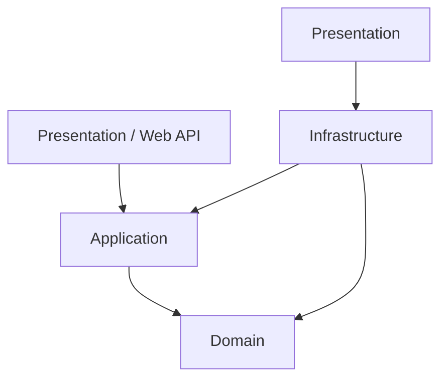

# Arquitetura e Camadas - MCP-RH

Este documento descreve a arquitetura técnica da plataforma MCP-RH, baseada em **ASP.NET Core 8.0+** seguindo os princípios de **Clean Architecture** e **Domain-Driven Design (DDD)**, com suporte nativo a **Multi-Tenancy**.

## 1. Arquitetura de Camadas (Clean Architecture)

A aplicação é organizada em camadas concêntricas, onde a dependência flui sempre para o centro (Domain).

### Diagrama de Camadas



### Responsabilidades por Camada

| Camada | Descrição |
| :--- | :--- |
| **Presentation (Web API)** | Ponto de entrada (Controllers), Middlewares, Filters e Swagger. Responsável por receber requests e retornar DTOs. |
| **Application** | Orquestração da lógica de negócio. Contém Commands, Queries, Handlers (MediatR), Mappers e validações de fluxo. |
| **Domain** | O "Coração" do sistema. Contém Entidades, Value Objects, Domain Services, Aggregates, Enums e Interfaces de Repositório. **Não possui dependências externas.** |
| **Infrastructure** | Implementações técnicas: Acesso a dados (EF Core), Integrações de Email, Storage, Provedores de IA e Identidade. |

---

## 2. Estrutura de Projetos (.csproj)

A solução é organizada em um **Monolito Modular**, facilitando a manutenção e possível evolução para microserviços.

### Organização de Pastas

```text
src/
├── MCPRH.WebAPI/               # Presentation (ASP.NET Core)
├── MCPRH.Application/          # Application Layer
├── MCPRH.Domain/               # Domain Layer
├── MCPRH.Infrastructure/       # Infrastructure (EF Core, Services)
└── MCPRH.Shared/               # Shared Kernel (Utilidades comuns)
tests/
├── MCPRH.UnitTests/
└── MCPRH.IntegrationTests/
```

### Namespaces
- `MCPRH.Domain.Entities.{Modulo}`
- `MCPRH.Application.Features.{Modulo}.Commands`
- `MCPRH.Infrastructure.Persistence.Configurations`

---

## 3. Módulos / Bounded Contexts

Os domínios são separados logicamente dentro das camadas para manter a coesão.

1.  **Identity & Tenant:** Gestão de usuários, papéis e isolamento de dados.
2.  **Core People:** Estrutura organizacional (Pessoas, Cargos, Hierarquia).
3.  **Assessments (DISC/EC):** Motores de avaliação comportamental e cultural.
4.  **PDI:** Gestão de planos de desenvolvimento, competências e gaps.
5.  **Performance (BSC):** Metas, indicadores e acompanhamento de resultados.
6.  **Engagement:** Clima organizacional, pulsos e humor.
7.  **AI Copilot:** Integração com LLMs para recomendações assistidas.

---

## 4. Padrões Arquiteturais

### CQRS com MediatR
A aplicação utiliza a separação de leitura (Queries) e escrita (Commands) no nível de código usando o padrão **Mediator**.
- **Commands:** Alteram o estado (Ex: `CreatePdiCommand`).
- **Queries:** Retornam dados sem efeitos colaterais (Ex: `GetPdiByEmployeeQuery`).

### Repository & Unit of Work
- **Repository Pattern:** Interfaces no Domain e implementação no Infrastructure (EF Core).
- **Unit of Work:** Garante atomicidade nas transações entre múltiplos repositórios.

### Domain Events
Entidades disparam eventos (Ex: `PdiCreatedEvent`) que são processados por Handlers para ações secundárias (notificações, auditoria).

---

## 5. Multi-Tenancy

O isolamento é mandatório e implementado em nível de aplicação e banco de dados.

### Estratégia de Isolamento
- **Shared Database, Isolated Rows:** Uma única base de dados onde cada tabela possui um `TenantId`.
- **Tenant Resolution Middleware:** Identifica o tenant via `Header`, `Subdomain` ou `JWT Claim`.
- **Global Query Filters (EF Core):** Filtro automático injetado no `DbContext` para garantir que um usuário nunca veja dados de outro tenant.

```csharp
// Exemplo de Filtro Global no EF Core
modelBuilder.Entity<Pdi>()
    .HasQueryFilter(p => p.TenantId == _tenantProvider.TenantId);
```

---

## 6. Dependency Injection

A organização segue o padrão de extensões `IServiceCollection`.

| Lifetime | Uso Típico |
| :--- | :--- |
| **Scoped** | Repositórios, DbContext, Handlers de Aplicação, TenantProvider. |
| **Transient** | Serviços leves sem estado, Validators (FluentValidation). |
| **Singleton** | Cache de memória, Configurações de IA, Provedores de Mensageria. |

---

## 7. Fluxo de Execução

1.  **Request:** Chega à API com Token JWT e TenantId.
2.  **Middleware:** Valida o Tenant e injeta o `ITenantProvider`.
3.  **Controller:** Envia um Command/Query via `IMediator`.
4.  **Application Handler:** Recebe o objeto, executa regras, chama o Repositório.
5.  **Domain:** Valida invariantes e regras de negócio.
6.  **Infrastructure:** Persiste os dados via EF Core com o filtro de Tenant ativo.
7.  **Response:** Retorna o resultado para o cliente.
